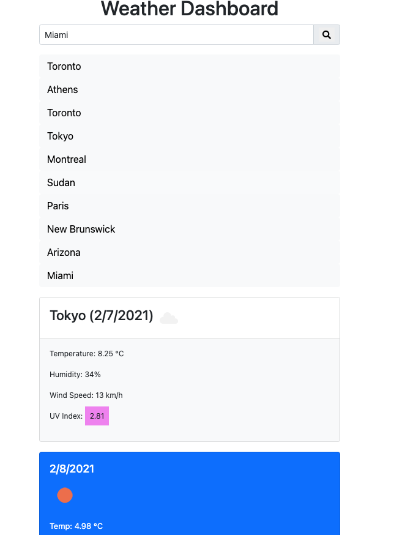
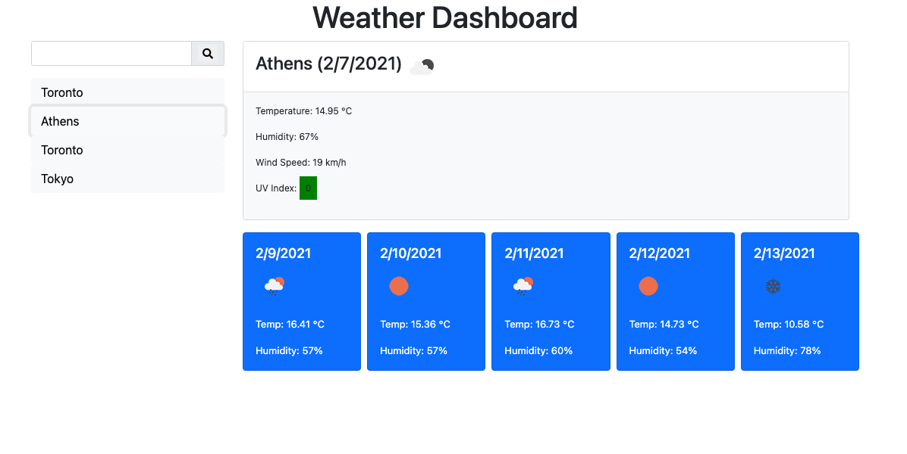
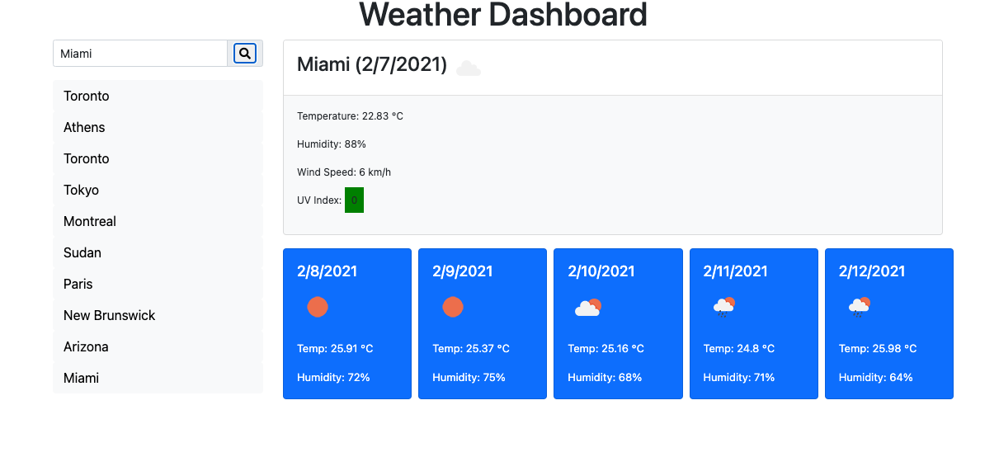
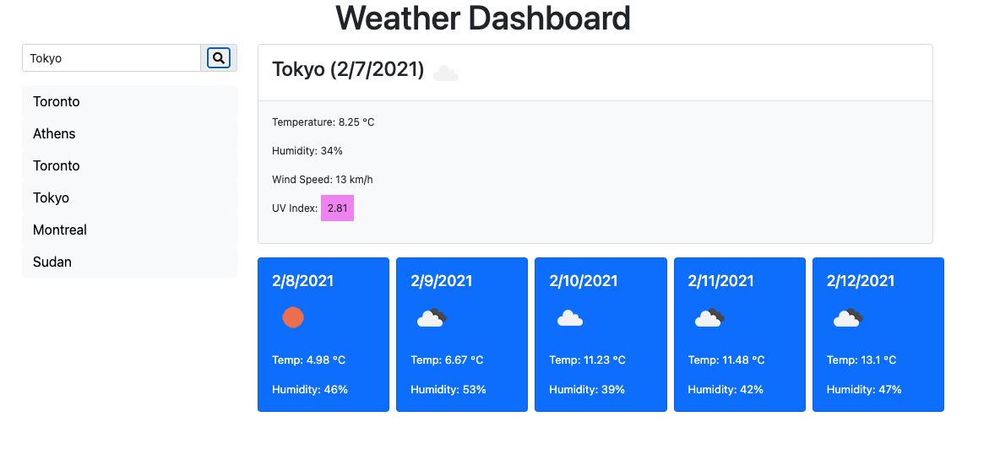

# Weather Dashboard

This application was designed to to showcase the use of local storage and API calls for weather data.  The local storage will help save previously searched locations and the API call to gather applicable weather data to display on the screen, for current day and the next five days.

Additional functionality that is showecased in this applicaiton is that once a city is searched it will be saved to the local storage.  A city that is searched again will not be resaved onto the as a check has been implemented to prevent this from occuring.

If you click on a city that is already on the list, that city information will be passed through the API to gather the relavent information to present to the user - the full weather data.

## __A link to the git repo housing this application can be found here:__
https://github.com/daze77/weatherDashboard

## __This is a link to the live webpage housing this application__
https://daze77.github.io/weatherDashboard/

## __Following are some images of the application as a reference:__

